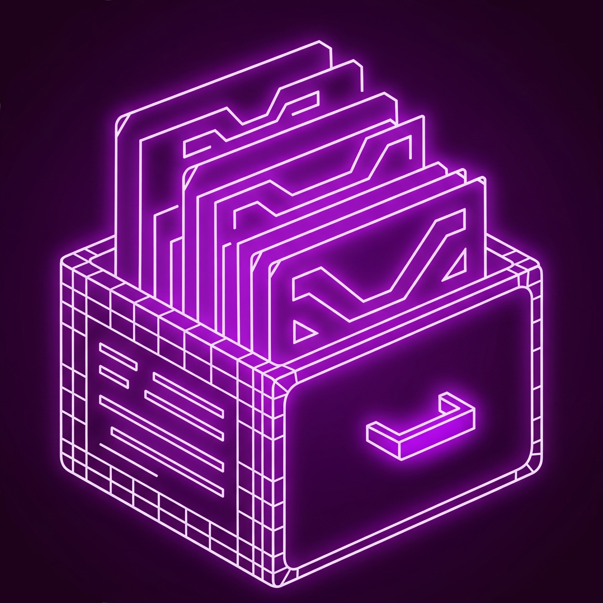
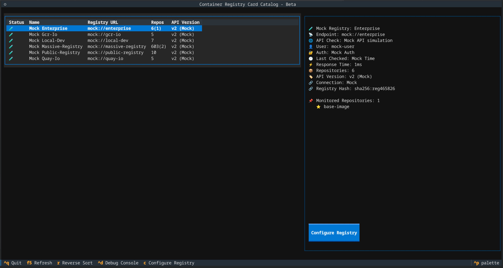
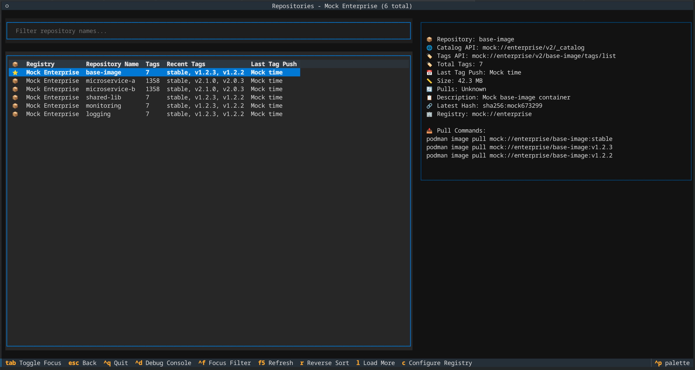
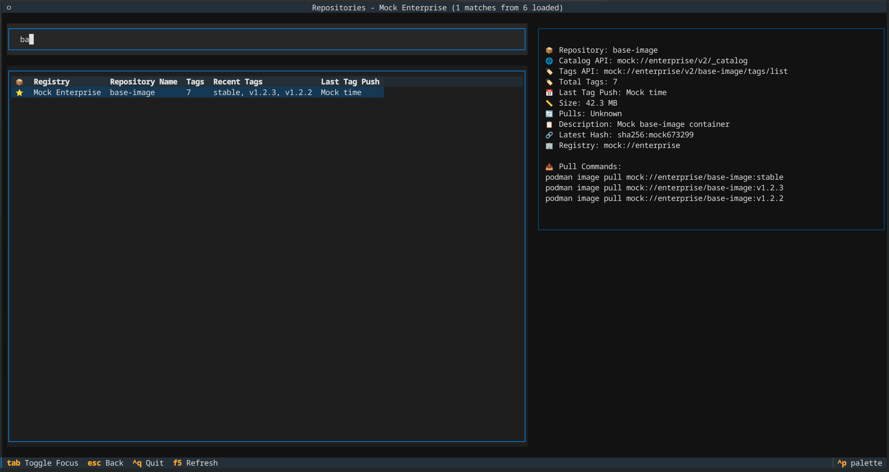
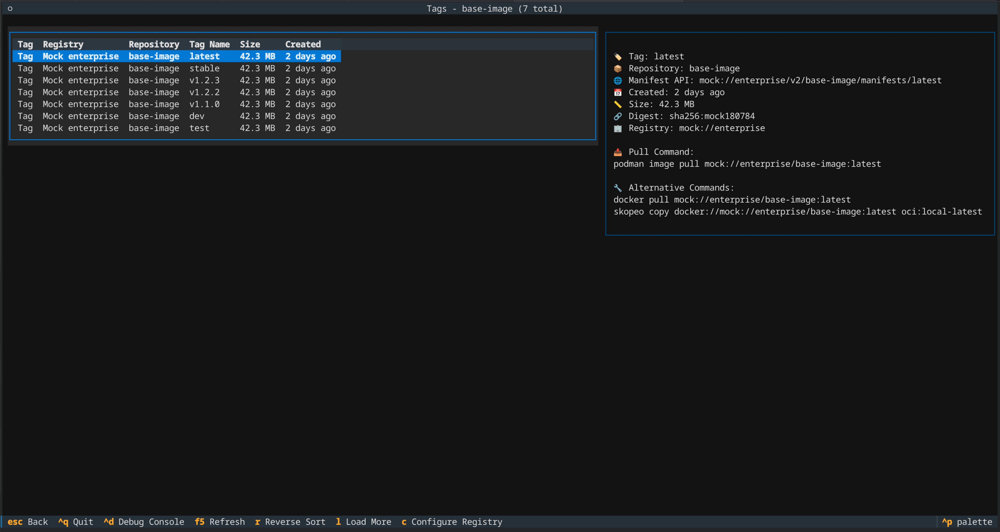
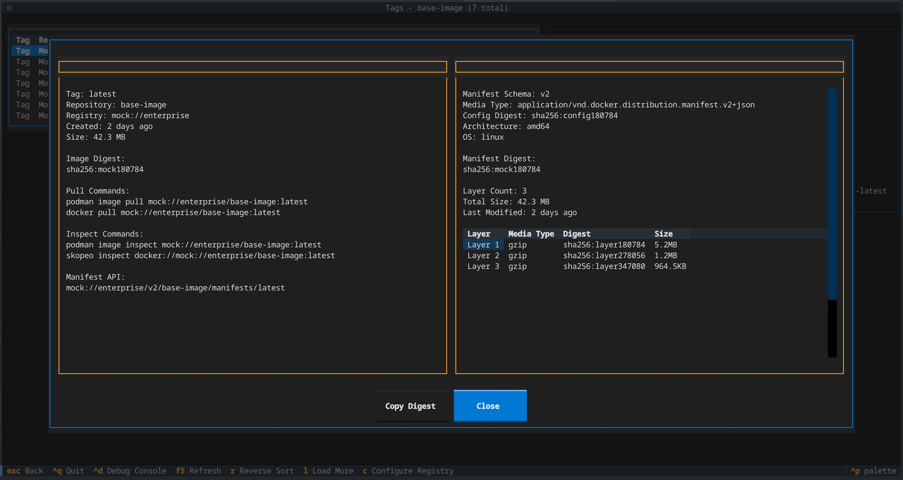
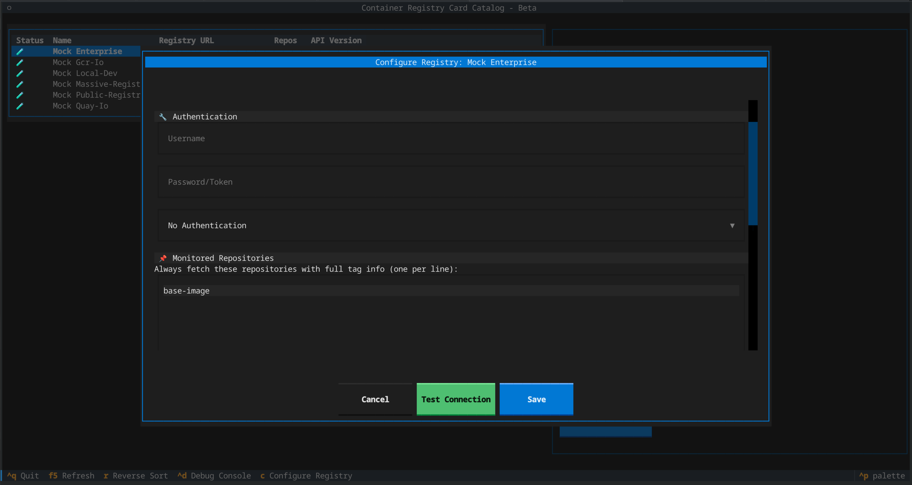
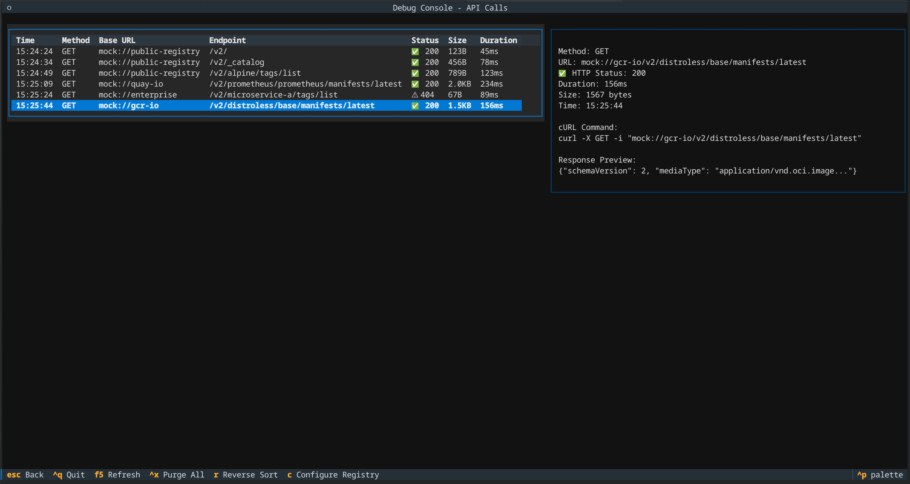
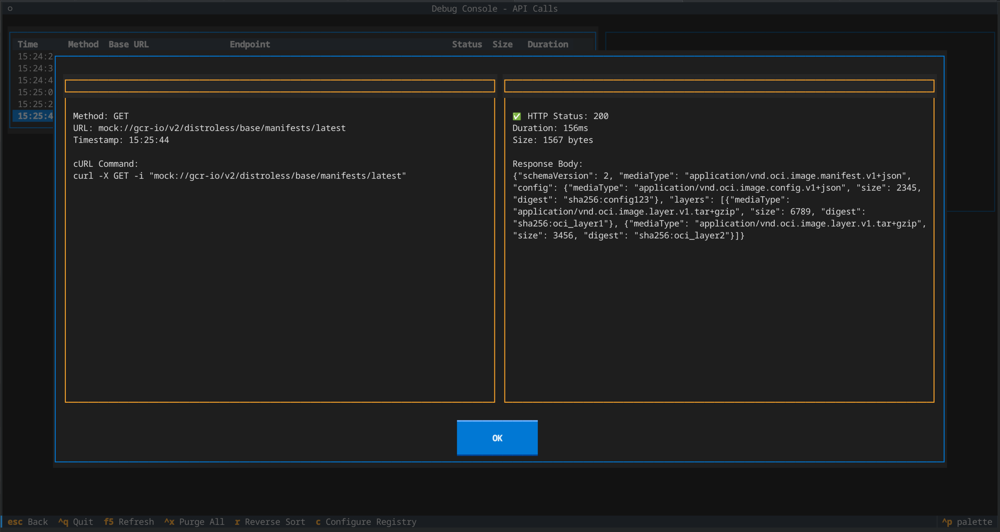

# Container Registry Card Catalog



A Terminal User Interface (TUI) application for browsing and exploring container registries built with [Textual](https://textual.textualize.io/).

## Screenshots

<p align="center">
  
  
</p>

<p align="center">
  
  
</p>

<p align="center">
  
  
</p>

<p align="center">
  
  
</p>

## Features

🌐 **Multi-Registry Support** - Connect to multiple container registries simultaneously  
🏠 **Local Container Support** - Browse local podman/docker containers with full metadata  
🔐 **Authentication Support** - Configure credentials for registries (basic, bearer, token auth)  
⭐ **Monitored Repositories** - Priority repositories always fetched first with full tag info and visual indicators  
📊 **Smart Repository Counts** - Display format shows total(monitored) e.g., "1003(3)" for comprehensive status  
💾 **Persistent Configuration** - Registry settings and monitored repositories survive application restarts  
📦 **Repository Browsing** - Navigate through repositories with an intuitive interface  
🏷️ **Tag Exploration** - View and explore container image tags with chronological sorting and real timestamps  
📋 **Manifest Details** - Deep dive into image manifests, layers, and digests (local & remote)  
📋 **Layer Inspection** - View layer information, media types, and sizes  
📎 **Clipboard Integration** - Copy digests to clipboard with platform detection  
🔍 **Debug Console** - Monitor API calls and responses for troubleshooting  
🧪 **Mock Mode** - Test with realistic mock data without real registry connections  
🚀 **Auto-Loading** - Smart pagination for datasets over 1000 items with cursor preservation  
🖱️ **Double-Click Navigation** - Double-click any row to navigate or view details  
⌨️ **Flexible Navigation** - Multiple ways to navigate (keyboard, mouse, shortcuts)  

## Quick Start

### Basic Usage

```bash
# Run with mock data (no real registry connections)
python container_registry_card_catalog.py --mock

# Browse local podman containers
python container_registry_card_catalog.py --local podman

# Browse local docker containers  
python container_registry_card_catalog.py --local docker

# Connect to specific registries
python container_registry_card_catalog.py --registry registry.example.com --registry quay.io

# Mix local and remote registries
python container_registry_card_catalog.py --local podman --registry quay.io

# View help
python container_registry_card_catalog.py --help
```

### Navigation

- **Arrow Keys**: Navigate through lists
- **Enter**: Select item or view details
- **Double-Click**: Navigate or view details (same as Enter)
- **Escape/Backspace**: Go back or close modals
- **Ctrl+Q**: Quit application (works everywhere)
- **Ctrl+D**: Open debug console
- **C**: Configure registry with authentication and monitored repositories (remote registries only)
- **R**: Refresh current view
- **L**: Load more items
- **Ctrl+X**: Purge debug log (debug console only)
- **Ctrl+C**: Copy digest to clipboard (tag detail modal)
- **Ctrl+F**: Focus repository filter
- **Tab**: Toggle focus between filter and table

### Modal Navigation

- **Page Up/Down**: Navigate between items in modals
- **Up/Down**: Same as Page Up/Down in modals
- **Enter**: Close modal
- **Escape**: Close modal

### Visual Indicators

- **⭐**: Monitored repositories (always appear first with full tag information)
- **📦**: Regular catalog repositories  
- **❌**: Failed/error repositories
- **Repository counts**: `total(monitored)` format - e.g., "1003(3)" shows 1003 total repositories with 3 monitored

## Installation

### Requirements

- Python 3.8+
- **For local container support**: podman or docker CLI tools
- Required packages:

```bash
pip install -r requirements.txt
```

Or install manually:
```bash
pip install textual aiohttp
```

### Clone and Run

```bash
git clone <repository-url>
cd container-registry-card-catalog
python container_registry_card_catalog.py --mock
```

## Architecture

The application follows a modular architecture:

```
container_registry_card_catalog.py   # Main application and registry view
├── registry_client.py               # Registry API client and manager
├── local_container_client.py        # Local podman/docker container support
├── mock_data.py                     # Mock registry data for testing
├── debug_console.py                 # Debug console for API monitoring
├── tags_view.py                     # Tags listing and navigation
├── tag_detail_modal.py              # Detailed tag information modal
└── api_detail_modal.py              # API call details modal
```

## Mock Mode

The application includes comprehensive mock data for testing and development:

- **5 Mock Registries**: Public, Quay.io, GCR, Local Dev, Enterprise
- **Realistic Repository Data**: Common base images and application containers
- **Diverse Tag Patterns**: Version tags, environment tags, architecture variants
- **Manifest Compatibility**: Both Docker and OCI manifest formats
- **Layered Images**: Realistic layer sizes and hierarchies
- **Full Configuration Support**: Mock mode supports all configuration features including monitored repositories with immediate UI updates
- **Accurate Repository Counting**: Proper de-duplication logic ensures repository counts match real registry behavior

## Registry Support

The application supports multiple registry types:

### Remote Registries (Docker Registry HTTP API v2)
✅ **Authentication Support** - Basic, Bearer, and Token authentication implemented

- **Docker Hub** - Bearer token authentication
- **Quay.io** - Token auth with robot accounts  
- **Google Container Registry (GCR)** - OAuth token support
- **Amazon Elastic Container Registry (ECR)** - AWS token support
- **Azure Container Registry (ACR)** - Standard authentication
- **Harbor** - Basic auth and robot accounts
- **Self-hosted registries** - Generic authentication support

### Local Container Runtimes
- **Podman** - Full support with metadata extraction (tested and verified)
- **Docker** - Full support with metadata extraction ⚠️ **(untested - podman-compatible implementation)**
- Automatic detection of container runtime capabilities

## API Compatibility

- **Docker Registry HTTP API v2**: Full support for catalog, tags, and manifest endpoints
- **OCI Distribution Specification**: Compatible with OCI manifest formats

## Development

### Adding New Features

1. Follow the existing patterns in the codebase
2. Update mock data in `mock_data.py` for testing
3. Add appropriate error handling
4. Update this README if needed

### Testing

Use mock mode extensively during development:

```bash
python container_registry_card_catalog.py --mock
```

## Attribution

This project was generated with AI assistance (Claude by Anthropic) with human guidance and acceptance. All code is provided under the chosen open source license.

**AI Attribution (AIA) Notice:**
- [AIA: EAI Hin R Claude Code v1.0](https://aiattribution.github.io/statements/AIA-EAI-Hin-R-?model=Claude%20Code-v1.0)
- Full: [AIA Entirely AI, Human-initiated, Reviewed, Claude Code v1.0](https://aiattribution.github.io/statements/AIA-EAI-Hin-R-?model=Claude%20Code-v1.0)
- Expanded: This work was entirely AI-generated. AI was prompted for its contributions, or AI assistance was enabled. AI-generated content was reviewed and approved. The following model(s) or application(s) were used: Claude Code.
- Interpretation: https://aiattribution.github.io/interpret-attribution
- More: https://aiattribution.github.io/
- Vibe-Coder: Andrew Potozniak <potozniak@redhat.com>
- Session Date: 2025-08-15 (Original), 2025-08-16 (Enhanced), 2025-08-27 (Auth & Monitoring)

## Licensing

This project is dual-licensed under:
- [**MIT License**](https://opensource.org/license/mit) - For strict legal certainty
- [**Vibe-Coder License (VCL-0.1-Experimental)**](https://github.com/tyraziel/vibe-coder-license) - [For those who serve the vibe](https://github.com/tyraziel/vibe-coder-license/blob/main/CODEX.md)

See [LICENSE](LICENSE) and [LICENSE-VCL](LICENSE-VCL.md) files for full terms.

## Contributing

Contributions are welcome! Please feel free to submit a Pull Request.

## Roadmap

- [x] **Authentication support** - Basic, bearer, and token authentication ✅
- [x] **Search and filtering capabilities** - Repository name filtering ✅
- [x] **Monitored repositories** - Priority repo configuration ✅
- [x] **Configuration file support** - Persistent monitored repos and settings storage ✅
- [ ] **Encrypted credential storage** - Secure authentication persistence (Phase 2)
- [ ] **TLS/HTTPS with certificate validation** - Currently disabled for compatibility
- [ ] **Export functionality** - Save repository lists, tag information
- [ ] **Image comparison features** - Compare tags and manifests
- [ ] **Registry state persistence** - Remember pagination/position when navigating
